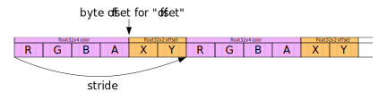

## webGPU

- 新一代gpu api (vs. webGL)
- 在提供`fragment shader`, `vertex shader`之外，提供`compputed shader` `GPGPU`：general purpose shader

## 一些GPU术语
- `shader` 一小段在gpu上运转的程序`vertex`,`fragment`
- `texture`
  - 2d array of color values
  - Textures can also be 3d rectangles of pixels, cube maps (6 squares of pixels that form a cube), and a few other things but the most common textures are 2d rectangles of pixels
- `map`
javascript 中的 arrayBuffer 不能直接映射到GPU当中，所以要指定映射关系
- `encode`
an "encoder" is a term used in various programming contexts to describe an interface or object that allows you to encode or package specific instructions or data in a particular format for further processing or transmission.
把一种格式写成另一种格式


## 基本概念

### Adapters & device
- `physical device`: GPU硬件
- `driver`
由GPU生产方提供，os调用driver 的 api 再暴露出去，os所用的api比如Vulkan 或者 Metal
- `device`由os（browser）提供的中间层（translation layer），目的是把各个app的运行环境独立分开（multiplexing）


```javascript
      // WebGPU device initialization
      if (!navigator.gpu) {
        throw new Error("WebGPU not supported on this browser.");
      }

      const adapter = await navigator.gpu.requestAdapter();
      if (!adapter) {
        throw new Error("No appropriate GPUAdapter found.");
      }
      const device = await adapter.requestDevice();
```

### pipeline
- 一个流程 ：data -> (vertex shader -> fragment shader) / compute shader ->render
- 这个章节只是说一下怎么创建一个pipeline,不涉及到执行和输入data的部分 
- 输入entryPoint, 组成部份有shader,输出根据不同的shader来
- `render`结果可以是`image`也可以是`memory`(frame buffer)

#### create pipeline
  - 创建一个compute shader的pipeline
```javascript
const module = device.createShaderModule({
  code: `
    @compute @workgroup_size(64)
    fn main() {
      // Pointless!
    }
  `,
});
const pipeline = device.createComputePipeline({
  compute: {
    module,
    entryPoint: "main",
  },
});
```
#### workgroup

- compute shader
- 用64就好 ：）
- 一个计算单元中并行的线程的数量
- GPU 内部是并行的（ EU -> subslice(share local memory) -> slice）
- 对于compute shader来说，每个指定的work item都会执行一次
  - workgroup / workitem 是三维的（x,y,z）方向形成的结构
  - 多个（eg:3x3x3）个workitems 形成一个workgrouop, 这几个workItem 会一起跑
  - 多个workGroup 会以相似的方式在三维中展开
- 可以类比vertex shader中的每个vertex 或 fragment shader中的每个 pixel
- 过少导致eu空置而没有充分利用GPU多线程运算的能力，过多可能超过上限，占用性能


```javascript
// 注意一下有上限的问题
// device.limits
{
  // ...
  maxComputeInvocationsPerWorkgroup: 256,
  maxComputeWorkgroupSizeX: 256,
  maxComputeWorkgroupSizeY: 256,
  maxComputeWorkgroupSizeZ: 64,
  maxComputeWorkgroupsPerDimension: 65535,
  // ...
}
```

#### dispatchWorkgroups

- index:
- @builtin
  - global_invocation_id
  - local_invocation_id
- workItem -> workGroup -> entity 的结构
  - global - workGroup的位置（x,y,z）
  - local - workItem 在 workGroup中的位置

```c
 code: `
    @compute @workgroup_size(8，8，8) // workgroup_size(64)
    fn main() {
        @builtin(global_invocation_id)
        global_id : vec3<u32>,

        @builtin(local_invocation_id)
        local_id : vec3<u32>,
    }
  `,
```

### 执行（render）
- GPU有自己的memory card, 会执行里面的command queue
- commandEncoder - encode command
- passEncoder 会给pipeline 去单独分配资源，而不是使用global state整个扔给gpu(webgl 的结构)
  
```javascript
const commandEncoder = device.createCommandEncoder()
// draw something
{
  pass = encoder.beginRenderPass(...)
  pass.setPipeline(...)
  pass.setVertexBuffer(0, …)
  pass.setVertexBuffer(1, …)
  pass.setIndexBuffer(...)
  pass.setBindGroup(0, …)
  pass.setBindGroup(1, …)

  /** 默认是3个点组成三角形
   有很多模式 
   'point-list': for each position, draw a point
'line-list': for each 2 positions, draw a line
'line-strip': draw lines connecting the newest point to the previous point
'triangle-list': for each 3 positions, draw a triangle (default)
'triangle-strip': for each new position, draw a triangle from it and the last 2 positions
   
   */
  pass.draw(...)
  pass.end()
}
//compute something else
{
  pass = encoder.beginComputePass(...)
  pass.beginComputePass(...)
  pass.setBindGroup(0, …)
  pass.setPipeline(...)
  //KEY:
  pass.dispatchWorkgroups(...)
  pass.end();
}
const commands = commandEncoder.finish();
device.queue.submit([commands]);
```

While GPUs are optimized for throughput (processing a lot of data simultaneously), individual tasks may experience higher latency due to the queuing and scheduling of tasks.
翻译一下就是，gpu喜欢排队，然后一起执行任务，让一次性能一起做的任务越多越好

### data
#### layout 蓝图
  - define types, purposes, uses

```javascript
const bindGroupLayout = 
  device.createBindGroupLayout({
    entries:[{
      binding:1,
      visibility:GPUShaderStage.COMPUTE,
      buffer:{
        // read-only-storage, uniform
        type:"storage"
      }
    }]
  });

  const pipeline = device.createComputePipeline({
    layout: device.createPipelineLayout({
      bindGroupLayouts:[bindGroupLayout],
    }),
  //......
  })

```

#### bind group
- bind group: GPU 的运算主体, 用layout 创建的instances
  - memory buffers, textures, samplers, etc.

```javascript
const BUFFER_SIZE = 1000;

const output = device.createBuffer({
  size: BUFFER_SIZE,
  usage: GPUBufferUsage.STORAGE | GPUBufferUsage.COPY_SRC
});


const bindGroup = device.createBindGroup({
  layout: bindGroupLayout, // | pipeline.getBindGroupLayout(0),
  entries: [{
    binding: 1,
    resource: {
      buffer: output,
    },
  }],
});


const commandEncoder = device.createCommandEncoder();
const passEncoder = commandEncoder.beginComputePass();
passEncoder.setPipeline(pipeline);
//KEY:
passEncoder.setBindGroup(0, bindGroup);
passEncoder.dispatchWorkgroups(Math.ceil(BUFFER_SIZE / 64));
passEncoder.end();
```

#### GPUBufferUsage
- javascript 中的 `arrayBuffer` 和 GPU 中用的 `createBuffer()` 不一致
- 1. GPU需要 createBuffer 才能被读写 - `GPUBufferUsage`
- 2. map 到 Javascript 中的是特定的buffer(从运行中拷贝一份出来)，因此不能再次用作storage等功能


#### texture
webGPU 的结果最后会输出为texture的形式,再以(context)为媒介渲染到canvas上


```javascript
 const context = canvas.getContext('webgpu');
//......
  const renderPassDescriptor = {
    label: 'our basic canvas renderPass',
    colorAttachments: [
      {
        // view: <- to be filled out when we render
        clearValue: [0.3, 0.3, 0.3, 1],
        loadOp: 'clear',
        storeOp: 'store',
      },
    ],
  };  


//KEY:创建view
    renderPassDescriptor.colorAttachments[0].view =
        context.getCurrentTexture().createView();
 

```

### @builtin(position)
- 完全不一样的意思
- vertex & pixel

```wgsl
 @fragment fn fs(@builtin(position)position:vec4f) -> @location(0) vec4f {}
 @vertex fn vs() -> @builtin(position):vec4f{}
```

### @location(0)
- related to vertex attribute
- 对vertex和fragment来说都算是vertex的数据
- fragment 会做interpolation
- all that WebGPU cares about is we return a value for builtin(position) from the vertex shader and return a color/value for location(0) from the fragment shader
- @location specifies which `GPURenderPassDescriptor.colorAttachment` to store the result in


```javascript

struct VSOutput{
  @builtin(position)position:vec4f;
  @location(0)color:vec4f;
}

@vertex
fn vs()->VSOutput{
}
@fragment
fn fn fs() -> @location(0) vec4f{
}
```

### uniform / storage
- storage
-  we can storage all data in the storage data
- tell webGPU how it is orgnized and access to it in the shader
- `GPUBufferUsage.INDEX | GPUBufferUsage.VERTEX | GPUBufferUsage.STORAGE`
#### inter-stage varibales
- between vertex and fragment
- eg: color with each vertex -> color after interpolation
```javascript
  @fragment fn fs(@location(0) color: vec4f) -> @location(0) vec4f {
        return color;
      }
```


```javascript
@group(0)@binding(2)var<storage, read>pos:array<Vertex>;
 pass.draw(numVertices,kNumObjects);

 //in wgsl
  vsOut.position = vec4f(
    pos[vertexIndex].position * otherStruct.scale + ourStruct.offset, 0.0, 1.0
  );
```
### vertex-buffers
```javascript
  struct Vertex {
    @location(0) position:vec2f;
  }

  const pipeline = device.createRenderPipeline({
    ...
    vertex:{
      ...
      buffers:[
        {
          arrayStride: 6 * 4, // 6 floats, 4 bytes each
          //optional, default is vertex
          stepMode: 'instance',
          attributes: [
            {shaderLocation: 1, offset:  0, format: 'float32x4'},  // color
            {shaderLocation: 2, offset: 16, format: 'float32x2'},  // offset
          ],
        
        }       
      ]
    }
  })

```


### index-buffers
```javascript

    const indexBuffer = device.createBuffer({
    label: 'index buffer',
    size: indexData.byteLength,
    usage: GPUBufferUsage.INDEX | GPUBufferUsage.COPY_DST,
  });
  device.queue.writeBuffer(indexBuffer, 0, indexData);
   pass.setIndexBuffer(indexBuffer, 'uint32');

   //compared with
   //kNumObjects-instances
   pass.draw(numVertices,kNumObjects);
```


### Unorm8x4
Four unsigned bytes (u8). [0, 255] converted to float [0, 1] vec4 in shaders.

### textures

Textures most often represent a 2d image. A 2d image is just a 2d array of color values.
- `sampler` :  A sampler can read up to 16 different values in a texture and blend them together
  - filter and blend multiple pixels
  - [0.0, 1.0]
  

```javascript
const sampler = device.createSampler({
      addressModeU: (i & 1) ? 'repeat' : 'clamp-to-edge',
      addressModeV: (i & 2) ? 'repeat' : 'clamp-to-edge',
      magFilter: (i & 4) ? 'linear' : 'nearest',
});

  const bindGroup = device.createBindGroup({
      layout: pipeline.getBindGroupLayout(0),
      entries: [
        { binding: 0, resource: sampler },
        { binding: 1, resource: texture.createView() },
      ],
    });
```

#### mipmap
Mipmaps are pre-generated versions of an image at various levels of detail.
 Mipmaps are a series of progressively smaller versions of an original texture, each half the size of the previous level.

 ```javascript
 const createTextureWithMips = (mips, label) => {
    const texture = device.createTexture({
      label,
      size: [mips[0].width, mips[0].height],
      mipLevelCount: mips.length,
      format: 'rgba8unorm',
      usage:
        GPUTextureUsage.TEXTURE_BINDING |
        GPUTextureUsage.COPY_DST,
    });
    mips.forEach(({data, width, height}, mipLevel) => {
      device.queue.writeTexture(
          { texture, mipLevel },
          data,
          { bytesPerRow: width * 4 },
          { width, height },
      );
    });
    return texture;
  };

   const sampler = device.createSampler({
      addressModeU: 'repeat',
      addressModeV: 'repeat',
      magFilter: (i & 1) ? 'linear' : 'nearest',
      minFilter: (i & 2) ? 'linear' : 'nearest',
      mipmapFilter: (i & 4) ? 'linear' : 'nearest',
    });


 ```


### webgpu bind group best practices
- `GPUBindGroup`
- declarations of the bind groups in the shaders
```c
@group(0)@binding(0) var<uniform> camera: Camera;
struct VertexOutput{
  @builtin(position) position:vec4f
}

@vertex fn vertexMain(@loaction(0) position:vec3f)->VertexOutput{
   output.position = camera.projection * camera.view * model * vec4f(position, 1);
}
```
- `GPUBindGroupLayout`
```javascript
const bindGroupLayout = gpuDevice.createBindGroupLayout({
  entries:[{
    binding:0,
    visibility:GPUShaderStage.VERTEX,
    buffer:{}
  }]
})
```
- `GPUPipelineLayout`

```javascript
const pipelineLayout = gpuDevice.createPipelineLayout({
  bindGroupLayouts:[
    bindGroupLayout
  ]
});

const pipelineA = gpuDevice.createRenderPipeline({
  layout:pipelineLayout, // could be replaced with 'auto'

  vertex:{
    module: vertexModuleA, // wgsl script
    entryPoint:'vertexMain'
  }
})
```

- create a bind group and using the same `GPUBindGroupLayout` 
```javascript
//createBuffer, createTexture, createSampler...
const cameraBuffer = gpuDevice.createBuffer({
  size:144,
  usage:GPUBufferUsage.COPY_DST | GPUBufferUsage.UNIFORM
});

const bindGroup = gpuDevice.createBindGroup({
  layout: bindGroupLayout,
  entries:[{
    binding:0,
    resource:{buffer: cameraBuffer}
  }]
})
```

- actually set the value, update the value within each `draw()` and `dispatch`

```javascript
const cameraArray = new Float32Array(36);
cameraArray.set....

device.queue.writeBuffer(cameraBuffer, 0, cameraArray);

const commandEncoder = device.createCommandEncoder();
const passEncoder = commandEncoder.beginRenderPass({...});

passEncoder.setPipeline(pipelineA);
passEncoder.setBindGroup(0, bindGroup);
passEncoder.draw(128);
passEncoder.end();


device.queue.submit([commandEncoder.finish()]);


```
## data type in shader
- uniforms, attributes(@location), buffers, textures, inter-stage variables, constants


